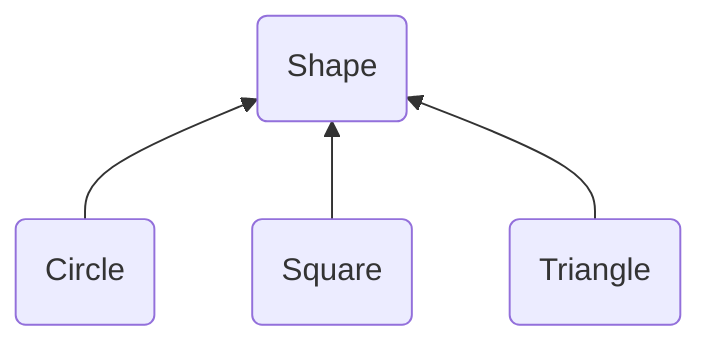

What is upcasting?

> Taking an **object** reference and treating it as a reference to its **base** type is called upcasting.

The term _upcast_ refers to the way inheritance hierarchies are traditionally represented with the base class at the top and derived classes fanning out below.

Inheritance and adding new member functions is the practice in [Smalltalk](https://en.wikipedia.org/w/index.php?title=Smalltalk&action=view&section=3#Object-oriented_programming), one of the first successful object-oriented languages in Smalltalk, everything is an object and the only way to create a class is to inherit from an existing class, often adding new member functions. Smalltalk heavily influenced Java, which also requires everything to be an object.

### Kotlin's way

Kotlin frees us from these constraints. We have stand-alone functions so everything doesn't need to be contained within the classes. _Extension functions_ allow us to add functionality without inheritance. Indeed, requiring the `open` keyword for inheritance makes it a very conscious and intentional choice, not something to use all the time.

### why upcast

Let's imagine this. We have 3 objects (`Circle`, `Square` and `Triangle`) that inherit the `Shape`. And we have a function -

```kotlin
fun show(shape: Shape) = print(shape.toString)
```



When we pass a `Circle`, `Square` or `Triangle` as an argument of type `Shape` in the `show()`, we cast up the inheritance hierarchy. In the process of upcasting, we lose the specific information about whether an object is of type `Circle`, `Square` or `Triangle`. It becomes nothing more than a `Shape` object.

Treating a specific type as a more generic type is the entire point of inheritance. The mechanics of inheritance exist solely to fulfil the goal of upcasting to the base type. Because of this abstraction (aka _everything is a `Shape`_), we can write a single `show` function of writing one for each of every type of elements. Upcasting is a way to reuse the code for objects.

### Composition over inheritance

Indeed, in virtually every case where there's inheritance without upcasting, inheritance is being misused -- it's unnecessary, and it makes the code needlessly complicated. The misuse is the reason for the maxim in Software Design:

> Prefer [composition over inheritance](https://en.wikipedia.org/wiki/Composition_over_inheritance)

If the point of inheritance is the ability to substitute a derived type for a base type, what happens to the extra member functions: `color()` in `Square` and `rotate()` in `Triangle`?

_Liskov Substitution Principle_ says that after upcasting, the derived type can be treated exactly like the base type. This means that any member functions added to the derived class are, in effect, "trimmed". They still exist, but because they are not part of base class interface, they are unavailable.

### Summary

Upcasting is a way to reuse the code for objects. One important thing to take note is that after the upcast, you can only call members of the base type.
